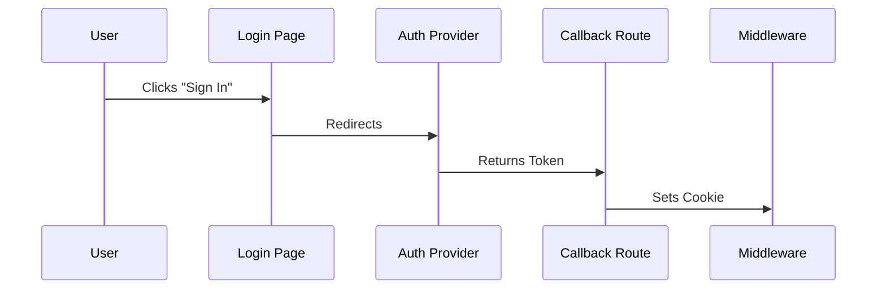

# Codebase Map

> **Status:** Auto-generated by Cartographer
> **Last Updated:** [Date]

## 1. System Overview

```mermaid
graph TB
    Client[Web Client (Next.js)] --> API[API Routes]
    API --> DB[(Postgres/Prisma)]
    API --> Auth[Auth Provider]

```

## 2. Key Modules

### `app/` (Routes)

* **Strategy:** [e.g., App Router with Route Groups]
* **Key Flows:**
* `/dashboard`: Protected User Area
* `/api/webhooks`: Stripe Listener


### `lib/` (Core Logic)

| File | Purpose | Critical Dependencies |
| --- | --- | --- |
| `db.ts` | Prisma Singleton | `DATABASE_URL` |
| `utils.ts` | Shared Helpers | None |

## 3. Data Flow

### Authentication Flow



## 4. "Gotchas" & Warnings

* [ ] **Middleware:** Runs on every request. Do not add heavy logic here.
* [ ] **Env:** `NEXT_PUBLIC_API_URL` must be set for client-side fetches.