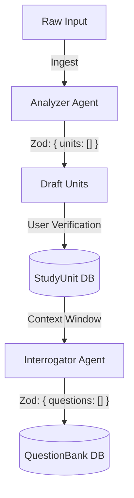
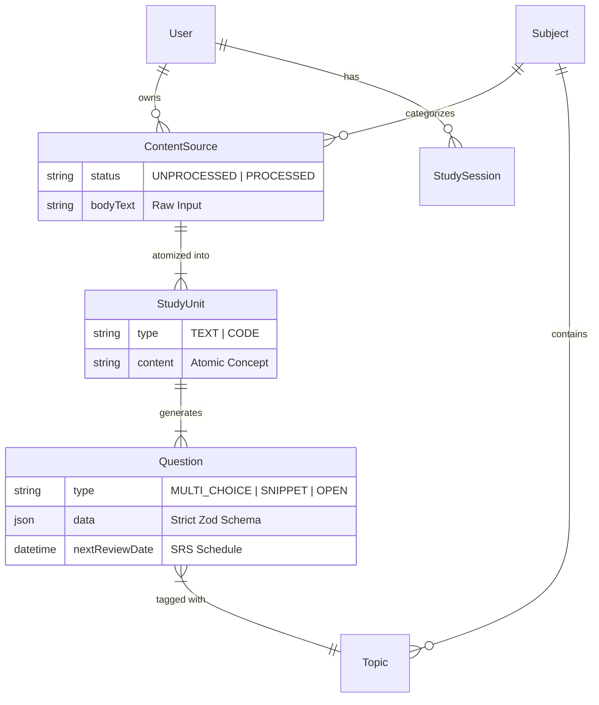

# System Architecture

> **Philosophy:** "Systemizer" Design
> This architecture is built to withstand high-entropy input (random notes, PDFs, code) and convert it into low-entropy, strictly typed "Study Units." It prioritizes Type Safety, Deterministic Logic, and Zero-Friction Ingestion.

## 1. System Overview

### 1.1 High-Level Architecture

```mermaid
graph TB
    Client[Web Client (Next.js)] --> API[App Router / Server Actions]
    API --> DB[(Postgres / Prisma)]
    API --> Auth[Clerk Auth]
    API --> Cache[Upstash Redis (Rate Limiting)]
    
    subgraph "Features"
        Dashboard
        Library
        StudySession
    end
    
    Client --> Dashboard
    Client --> Library
    Client --> StudySession
```

### 1.2 The "Systemizer" Map
The application is structured to mirror the user's mental model:
*   **Dashboards** represent "Status" (Am I safe? Am I behind?).
*   **Library** represents "The Warehouse" (Raw Materials).
*   **Study Session** represents "The Factory" (Processing Materials).

> **Philosophy:** "Systemizer" Design
> This architecture is built to withstand high-entropy input (random notes, PDFs, code) and convert it into low-entropy, strictly typed "Study Units." It prioritizes Type Safety, Deterministic Logic, and Zero-Friction Ingestion.

---

## 2. Engineering Principles (The "Anti-Slop" Guarantee)

The codebase assumes the user is in a state of "Analysis Paralysis." Therefore, the engineering must provide absolute certainty. We do not use "Magic" where logic is hidden; we use **Type Safety** and **Deterministic Algorithms**.

### 2.1 Critical Type Safety
We use a "Double-Wall" defense against runtime errors:
1.  **Database Layer (Prisma):** Auto-generated types from the schema ensure that if the DB changes, the build fails immediately.
2.  **API Boundary (Zod):** Every implementation of an AI response or User Input is validated at runtime. We never trust the LLM's JSON output blindly; it must pass a strict Zod Schema (`safeParse`).

### 2.2 Deterministic Study Logic (Custom SM-2)
Many study apps rely on black-box algorithms. We implemented a custom, verifiable Spaced Repetition System (SRS).
*   **The Algorithm:** A modified SM-2 (SuperMemo-2).
*   **The Modifications:**
    *   **Systemizer Score:** We calculate a priority score (`srs-algorithm.ts`) that weights "Code/Snippet" questions higher than generic text, satisfying the user's preference for technical drilling.
    *   **The Floor:** A "Crisis Mode" filter that finds the absolute minimum set of cards (Stability < 3 days) to keep a streak alive without burnout.
*   **Why Custom?** It allows us to unit test the scheduling logic (`npm test`) without mocking a 3rd party library, ensuring the "Next Review Date" is mathematically proven correct.

### 2.3 Performance & UX Patterns
*   **Optimistic UI:** When a user completes a review, the UI updates instantly (via React Query cache invalidation) while the server action runs in the background.
*   **Edge-Ready Rate Limiting:** We protect the "Intelligence Layer" with Redis-backed rate limiting (`10 req / 10 min`) to prevent API cost spirals while allowing bursts of legitimate activity.

---

## 3. The Intelligence Layer

The "Brain" of the application is an **Ingestion-Atomization-Interrogation** pipeline. It is agnostic of the underlying LLM (currently transitioning between Gemini and Claude) but strict about the *structure* of data it produces. All AI inputs are "High Entropy" (raw text) and all outputs are "Strictly Typed JSON" (Zod Schema).

### 3.1 Pipeline Architecture



### 3.2 The "Analyzer" (Atomization)
*   **Goal:** Break large documents into atomic concepts without user effort.
*   **Implementation:** `features/library/actions/analyze-content.ts`
*   **Strategy:**
    *   **Prompt Persona:** "Strict Teacher" - instructed to identify concepts, not just summarize.
    *   **Two-Pass Logic:**
        1.  **Macro-Analysis:** Identifies the single best `Subject` (e.g., "Computer Science") and list of `Topics`.
        2.  **Micro-Chunking:** Splits text into `units` with types:
            *   `TEXT`: Theory, definitions, history.
            *   `CODE`: Syntax, implementation detail (triggers specialized Monaco editor).

### 3.3 The "Interrogator" (Active Recall)
*   **Goal:** Prove competence through "Ruthless" testing.
*   **Implementation:** `features/library/actions/generate-questions-preview.ts`
*   **Strategy:**
    *   **Prompt Persona:** "Ruthless Examiner" - instructed to create distractors that are plausible/tricky.
    *   **Context Injection:** Feeds `Subject` + `Topic` tags to the LLM to prevent generic questions.
    *   **Output Schema (`QuestionSchema`):**
        *   `type`: `MULTIPLE_CHOICE | OPEN | CODE`
        *   `correctAnswer`: The source of truth.
        *   `explanation`: Why the answer is correct (for feedback).

### 3.4 Rate Limiting & Cost Control
To prevent API abuse and cost overrun, the Intelligence Layer is protected by a strict sliding window limiter:
*   **Limits:** 10 AI requests per 10 minutes per user.
*   **Storage:** Redis-backed (`@upstash/ratelimit`).
*   **Pattern:** `ratelimit.limit(userId)` wraps every generation action.

---

## 4. Data Core (The "Systemizer" Memory)

The database schema is designed to enforce strict ownership and hierarchical processing. We do not use unstructured JSON blobs for core data; everything is relational.

### 4.1 Entity Relationship Diagram



### 4.2 Key Models
| Model | Purpose | "Systemizer" Rationale |
| :--- | :--- | :--- |
| **ContentSource** | The raw material (PDF, Notes, URL). | Immutable "Source of Truth." If the AI hallucinates, we can always trace back to this original text. |
| **StudyUnit** | An atomic concept extracted from the source. | Breaks "Big Data" into "Small Data." Solves the "Interrogation" problem by isolating specific facts. |
| **Question** | The active recall test. | The only mutable entity (SRS stats update here). Separating `Question` from `Unit` allows multiple angles of attack on the same concept. |


---

## 5. Application Layer (Next.js 16)

We rely on standard Next.js 16 patterns to keep the implementation boring and predictable.

### 5.1 Project Structure
*   `src/app/` **(Routes):** Minimal logic. Responsible for layout and metadata only. Imports feature components.
*   `src/features/` **(Business Logic):** collocated components, actions, and hooks.
    *   `features/[name]/actions`: Server Actions (Zod-protected).
    *   `features/[name]/components`: Feature-specific UI.
    *   `features/[name]/schemas`: Zod contracts.
*   `src/shared/ui/` **(Design System):** "Dumb" UI components (Card, Button, Badge) with no business logic.

### 5.2 Server Actions Pattern
All mutations follow a strict "RPC-like" pattern:
1.  **Auth Check:** `requireUser()` (Throws if anon).
2.  **Rate Limit:** `ratelimit.limit(userId)` (Throws if abuse).
3.  **Input Validation:** `Schema.parse(input)` (Throws if invalid).
4.  **DB Mutation:** Prisma transaction.
5.  **Revalidate:** `revalidatePath()` to update UI.

## 6. Security & Access Control

### 6.1 Authentication (Clerk)
We delegate identity management to Clerk to avoid rolling our own crypto.
*   **Lazy Creation:** We use a "Just-in-Time" user creation pattern (`auth.ts`). When a user logs in via Clerk, we check if they exist in our Postgres DB. If not, we create them instantly. This prevents sync issues.

### 6.2 Row Level Security (RLS)
Since we use Prisma (which doesn't have native RLS like Supabase), we enforce "Software RLS" in every query.
*   **Rule:** Every `findMany` or `findFirst` MUST include `where: { userId }`.
*   **Enforcement:** Code reviews and standard patterns.
*   **Mutation Protection:** `delete` actions always check `count({ where: { id, userId } })` before deletion to prevent IDOR attacks.
