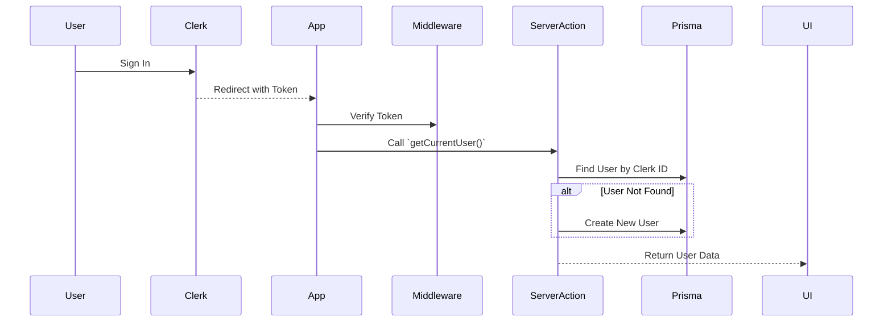
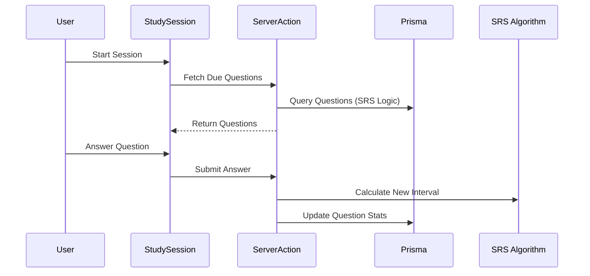

# Codebase Map

> **Status:** Auto-generated by Cartographer
> **Last Updated:** 2026-01-17

## 1. System Overview

```mermaid
graph TB
    Client[Web Client (Next.js)] --> API[App Router / Server Actions]
    API --> DB[(Postgres / Prisma)]
    API --> Auth[Clerk Auth]
    API --> Cache[Upstash Redis (Rate Limiting)]
    
    subgraph "Features"
        Dashboard
        Library
        StudySession
    end
    
    Client --> Dashboard
    Client --> Library
    Client --> StudySession
```

## 2. Key Modules

### `src/app/` (Routes)

* **Strategy:** App Router with Feature modules.
* **Key Flows:**
  * `/dashboard` (`page.tsx`) - Main user interface.
  * `/library` (`library/page.tsx`) - Content management.
  * `/study` (`study/page.tsx`) - Active study sessions.
  * `/sign-in`, `/sign-up` - Clerk Authentication flows.

### `src/features/` (Business Logic)

| Feature | Purpose | Key Components |
| --- | --- | --- |
| `dashboard` | User overview and stats | `DashboardMenu` |
| `library` | Content ingestion and management | `getSources` |
| `study-session` | SRS Study Logic | `actions`, `components`, `hooks`, `ui` |

### `src/lib/` (Core Utilities)

| File | Purpose | Critical Dependencies |
| --- | --- | --- |
| [`auth.ts`](../src/lib/auth.ts) | Clerk + Prisma Lazy User Creation | `@clerk/nextjs`, `prisma` |
| [`prisma.ts`](../src/lib/prisma.ts) | Prisma Client Singleton | `@prisma/client` |
| [`ratelimit.ts`](../src/lib/ratelimit.ts) | API Rate Limiting | `@upstash/ratelimit`, `@upstash/redis` |
| [`srs-algorithm.ts`](../src/lib/srs-algorithm.ts) | Spaced Repetition Logic | None |

### `src/shared/ui` (Design System)

* **Components:** [`Button`](../src/shared/ui/Button.tsx), [`Card`](../src/shared/ui/Card.tsx), [`Badge`](../src/shared/ui/Badge.tsx), [`Modal`](../src/shared/ui/Modal.tsx), [`SearchInput`](../src/shared/ui/SearchInput.tsx).
* **Styling:** Tailwind CSS + Lucide Icons.

## 3. Data Flow

### Authentication & User Creation



### Study Session Flow


