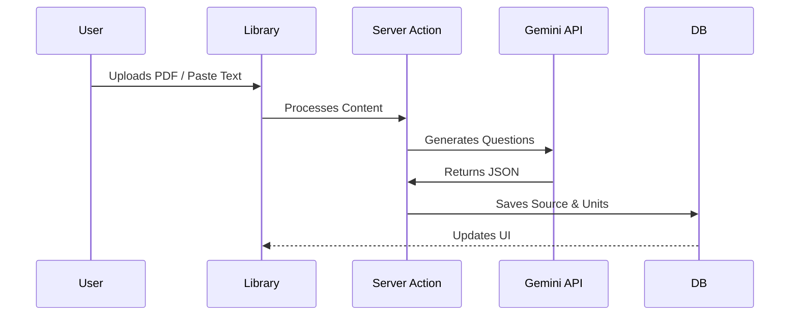
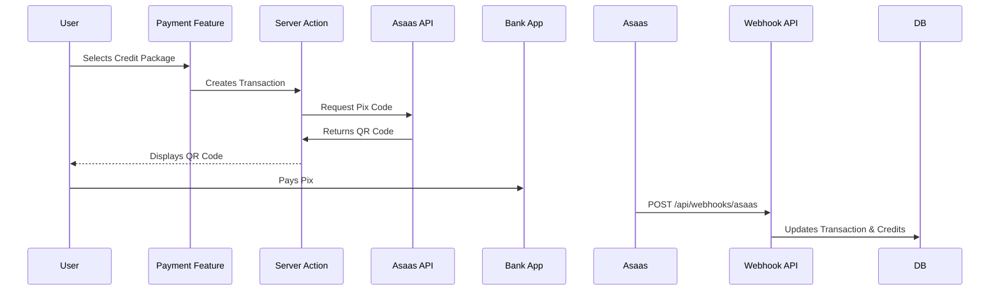

# Codebase Map

> **Status:** Auto-generated by Cartographer
> **Last Updated:** 2026-01-19

## 1. System Overview

```mermaid
graph TB
    Client[Web Client (Next.js 16)] --> Proxy[Proxy / Middleware]
    Proxy --> Routes[App Router (src/app)]
    Routes --> Features[Feature Modules (src/features)]
    Features --> Lib[Core Libs (src/lib)]
    Features --> DB[(Postgres / Prisma)]
    
    subgraph External
        Clerk[Clerk Auth]
        Asaas[Asaas Payments]
        Gemini[Google Gemini AI]
    end

    Client --> Clerk
    Client --> Asaas
    Lib --> Gemini
```

## 2. Key Modules

### `src/app/` (Routing Layer)
* **Strategy:** Next.js App Router with i18n `[locale]` dynamic route.
* **Key Flows:**
    * [`[locale]/dashboard`](file:///home/henry/AntigravityProjects/study-platform/src/app/[locale]/dashboard/page.tsx): Main authenticated user area.
    * [`[locale]/library`](file:///home/henry/AntigravityProjects/study-platform/src/app/[locale]/library/page.tsx): Content management and study unit generation.
    * [`[locale]/study`](file:///home/henry/AntigravityProjects/study-platform/src/app/[locale]/study/page.tsx): Active study session interface.
    * [`api/webhooks`](file:///home/henry/AntigravityProjects/study-platform/src/app/api/webhooks): Listeners for external events (e.g. Asaas).

### `src/features/` (Domain Logic)
This project uses a **Feature-based Architecture**. Each folder contains components, hooks, and logic specific to a domain.

| Feature | Purpose | Critical Files |
| --- | --- | --- |
| `library` | Managing sources, generating units, editing questions | [`SourceInspector`](file:///home/henry/AntigravityProjects/study-platform/src/features/library/SourceInspector.tsx) |
| `study-session` | Flashcard and SRS logic | [`FlashCards`](file:///home/henry/AntigravityProjects/study-platform/src/features/study-session/FlashCards.tsx) |
| `dashboard` | User overview, stats, recent items | [`DashboardFeature`](file:///home/henry/AntigravityProjects/study-platform/src/features/dashboard/DashboardFeature.tsx) |
| `payment` | Credits system, transaction history | [`CreditModel`](file:///home/henry/AntigravityProjects/study-platform/src/features/payment/CreditModel.tsx) |
| `landing` | Public facing marketing pages | [`Hero`](file:///home/henry/AntigravityProjects/study-platform/src/features/landing/Hero.tsx) |

### `src/shared/` (Reusable Code)
* **`ui/`**: Core Design System components (likely Shadcn/Zinc theme).
* **`hooks/`**: Global hooks.
* **`utils/`**: Shared helper functions.

### `src/lib/` (Infrastructure & Core Services)
| File | Purpose | Critical Dependencies |
| --- | --- | --- |
| [`prisma.ts`](file:///home/henry/AntigravityProjects/study-platform/src/lib/prisma.ts) | Database Singleton | `DATABASE_URL` |
| [`auth.ts`](file:///home/henry/AntigravityProjects/study-platform/src/lib/auth.ts) | Auth Utilities | `@clerk/nextjs` |
| [`asaas.ts`](file:///home/henry/AntigravityProjects/study-platform/src/lib/asaas.ts) | Payment Gateway Integration | `ASAAS_API_KEY` |
| [`srs-algorithm.ts`](file:///home/henry/AntigravityProjects/study-platform/src/lib/srs-algorithm.ts) | Spaced Repetition Logic | None |
| [`ratelimit.ts`](file:///home/henry/AntigravityProjects/study-platform/src/lib/ratelimit.ts) | API Rate Limiting | Upstash Redis |

## 3. Data Flow

### content Generation Flow


### Payment Flow (Asaas Pix)


## 4. "Gotchas" & Constraints
* [ ] **Middleware Pattern:** The project uses [`src/proxy.ts`](file:///home/henry/AntigravityProjects/study-platform/src/proxy.ts) to configure Clerk and i18n middleware, which is an unconventional naming (usually `middleware.ts`).
* [ ] **No `src/services`:** Business logic is distributed between `src/lib` (infrastructure) and `src/features` (domain logic), rather than a centralized service layer.
* [ ] **Internationalization:** All user facing text MUST use `next-intl`. Translations are in `messages/en-US.json` and `messages/pt-BR.json`.
* [ ] **Strict Types:** `tsconfig.json` enforces strict mode. Avoid `any`.
